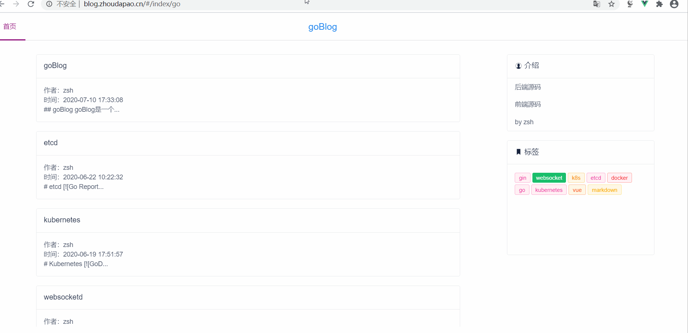

## goBlog

goBlog是一个前后端分离的极简风格博客系统，后端使用gin框架开发，遵循Restful接口规范，数据库存储使用mongodb。

[前端仓库](https://github.com/masterZSH/vue-blog)


## 使用
1. 配置文件 修改configs/app.default.ini为/configs/app.ini

2. 调试  go run main.go

3. 构建  go build

## jwt
简单的jwt实现


## 前端 

框架 vue全家桶搭建单页面应用

vue+vue-cli+vuex+vue-router

UI iView(桌面端) mint-ui(移动端)

打包 esbuild 替换webpack？

markdown编辑器 

https://github.com/markedjs/marked


## 优化

```bash
ab -n 4000 -c 100 http://domain:8080/v1/tags
```
优化前
Requests per second:    40.95 [#/sec] (mean)

引入sync.Pool优化后
Requests per second:    980.82 [#/sec] (mean)


## 在线

[在线示例](http://blog.zhoudapao.cn)


## 演示




